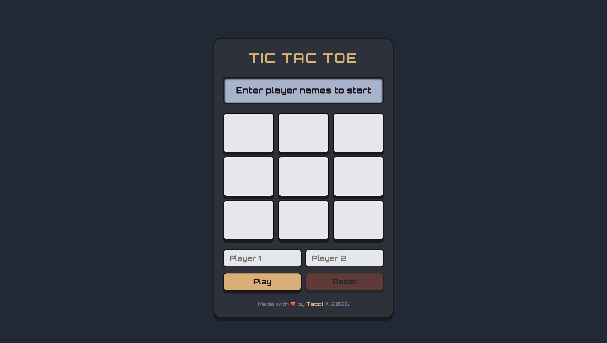

# Tic Tac Toe

> A fully functional Tic Tac Toe game built with HTML, CSS and JavaScript, designed with a retro calculator-inspired aesthetic.

---

## 🔗 Live Demo

**Live Demo:** [taaccii.github.io/tic-tac-toe](https://taaccii.github.io/tic-tac-toe/)

---

## ✨ Features

- **Factory functions and IIFE modules** — game logic split across `Cell`, `Gameboard`, `createPlayer`, `GameController` and `DisplayController`, each with a clear responsibility
- **Zero global code** — everything encapsulated inside factories and IIFEs, private variables kept private via closures
- **Win and tie detection** — checks all 8 winning combinations after every move, detects a full board for ties
- **Player name input** — custom names entered before each match, validated before the game starts
- **LCD display** — shows current turn, winner and tie messages on a single retro-style screen
- **Color-coded feedback** — display turns green on victory, gold on a tie, red on invalid input
- **Button state management** — Play and Reset are enabled/disabled contextually to prevent invalid interactions
- **Press animations** — buttons and board cells animate on click with `translateY` and `scale`, matching the calculator aesthetic
- **Retro design** — dark plastic casing, Orbitron font, color scheme inspired by my Calculator project
- **Google Fonts** — Orbitron for the retro-tech look

---

## 🛠️ Tech Stack

| Component | Technology |
|-----------|------------|
| **Markup** | HTML5 |
| **Style** | CSS3 |
| **Logic** | JavaScript (ES6+) |
| **Layout** | Flexbox + CSS Grid |
| **Font** | Google Fonts — Orbitron |
| **Shadows** | Josh Comeau Shadow Palette |

---

## 🏗️ Architecture

| Module | Pattern | Responsibility |
|--------|---------|----------------|
| `Cell` | Factory | Stores a single cell's value with private state |
| `Gameboard` | IIFE | Manages the 3×3 board, move placement, win/tie logic |
| `createPlayer` | Factory | Creates player objects with name and sign |
| `GameController` | IIFE | Controls game flow, turns, and game state |
| `DisplayController` | IIFE | Handles all DOM rendering and user interactions |

---

## 💡 What I Learned

- Organizing code with factory functions and the module pattern (IIFE)
- Using closures to create private variables that can't be accessed or modified directly from outside
- Separating game logic from DOM logic: `GameController` never touches the DOM, `DisplayController` never manages game state
- Building and traversing a 2D array to represent the board
- Checking winning combinations with `Array.every()` and destructuring `([r, c])`
- Managing UI state with `classList.add/remove` and the `disabled` attribute
- Using `setTimeout` for timed visual feedback (error flash on the display)
- Using `dataset` to store row/column data directly on DOM elements
- Designing a consistent color scheme across multiple projects

---

## 📝 Notes

This was my first project to combine factory functions, closures and the module pattern in a real application. The hardest part was deciding where each piece of logic should live, and it took several iterations to cleanly separate `GameController` from `DisplayController`. I intentionally kept DOM manipulation as minimal as possible, re-rendering only what changed rather than rebuilding the entire UI on every interaction. The retro calculator aesthetic was inspired by my previous Calculator project and gave me a chance to reuse and adapt a design system I had already built.

---

## 📄 License

This project is licensed under the **MIT License** — see [`LICENSE`](./LICENSE) for details.

---

## 👨‍💻 Author

**Taaccii**

- 📧 [taccidev@gmail.com](mailto:taccidev@gmail.com)
- 🐙 GitHub: [@Taaccii](https://github.com/Taaccii)
- 💼 LinkedIn: [alessandro-barletta-dev](https://linkedin.com/in/alessandro-barletta-dev)

---

> *Project built as part of [The Odin Project](https://www.theodinproject.com/lessons/node-path-javascript-tic-tac-toe) JavaScript curriculum.*